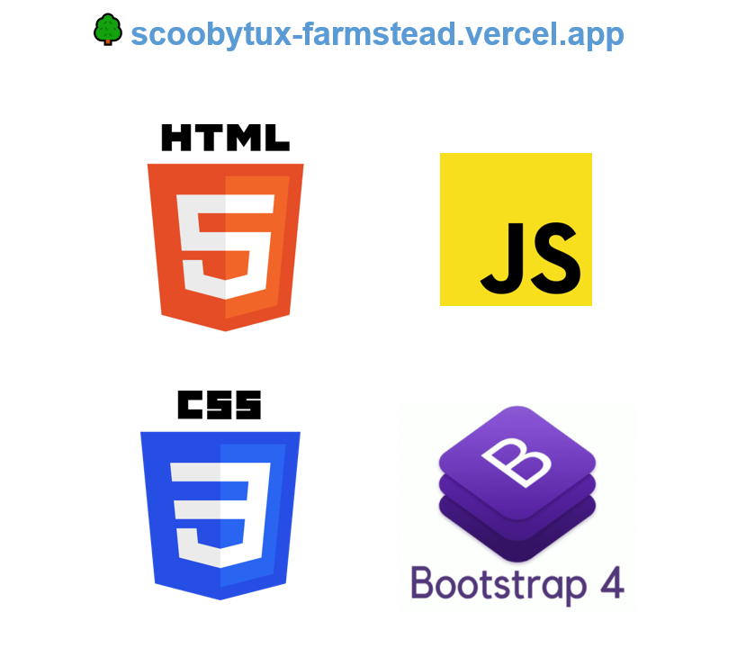
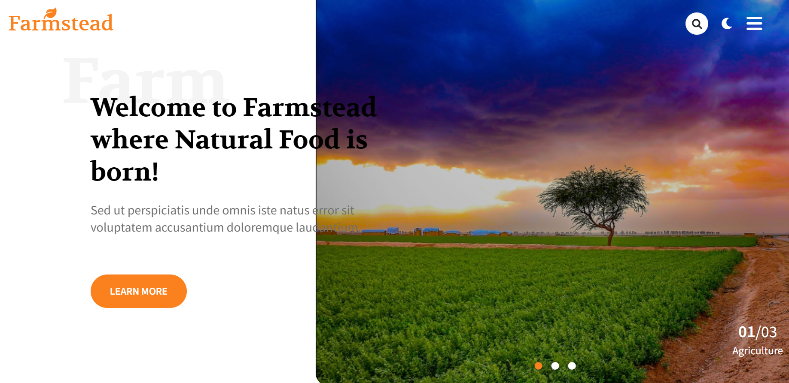
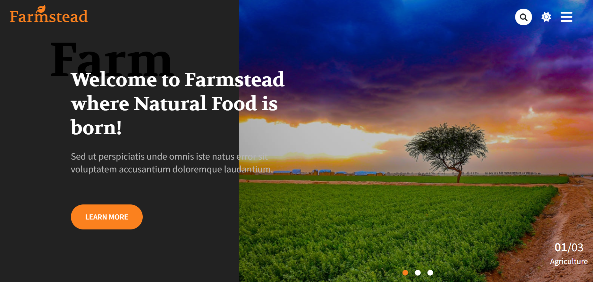
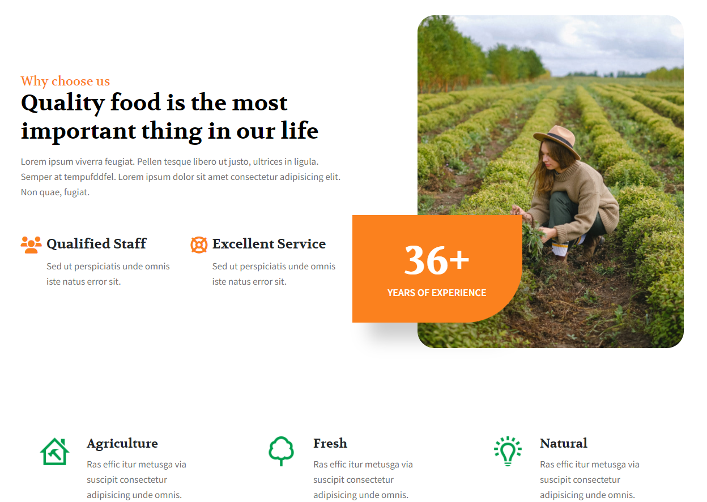
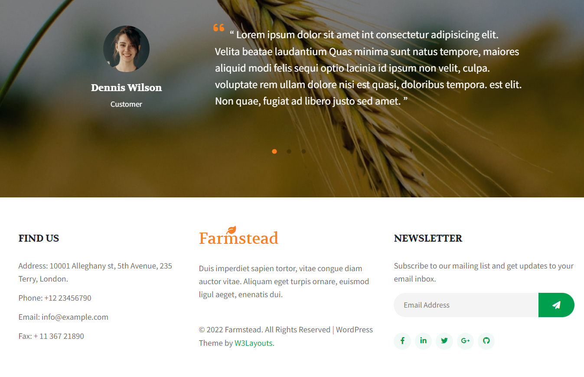

# Farmstead Homepage Layout

See the live page [Farmstead](https://scoobytux-farmstead.vercel.app "Farmstead") 🌳

## Introduction

A webpage layout built with HTML5, CSS3, Bootstrap 4 and vanilla Javascript.

## Languages and Tech Stack



## Tasks

> March 4 - 19, 2022

Our main tasks in the project are to implement:

- [x] Homepage layout
- [x] Responsive design
- [x] Full effects
- [x] Themes: light and dark

## Project Structure

```
$PROJECT_ROOT
│   # Resource files
├── assets
│   │   # Image file
│   ├── images
│   │   # Javascript file
│   ├── scripts
│   │   # CSS file
│   └── styles
│   # Screenshots of the project
├── screenshots
│   # Roadmap of the project
├── checklist.xlsx
│   # Page content
└── index.html
```

### Installation and Run

Check out the webpage -> [Farmstead](https://scoobytux-farmstead.vercel.app "Farmstead") or run locally:

- `git clone https://github.com/scoobytux/farmstead.git`
- `cd farmstead`
- Open `index.html` file

## Some Screenshots

- Header and carousel section

  - Light

  

  - Dark

  

- Features section

  

- Testimonials section and footer

  

## Contributors

| Name             | Email                     |
| ---------------- | ------------------------- |
| Le Nguyen Anh Tu | tu.lna07@gmail.com        |
| Tran Duc Thanh   | thoatran1112211@gmail.com |

## Credits and reference

| Resource                                               | Description          |
| ------------------------------------------------------ | -------------------- |
| [https://wp.w3layouts.com/farmstead/][original layout] | The original website |

[original layout]: https://wp.w3layouts.com/farmstead/
